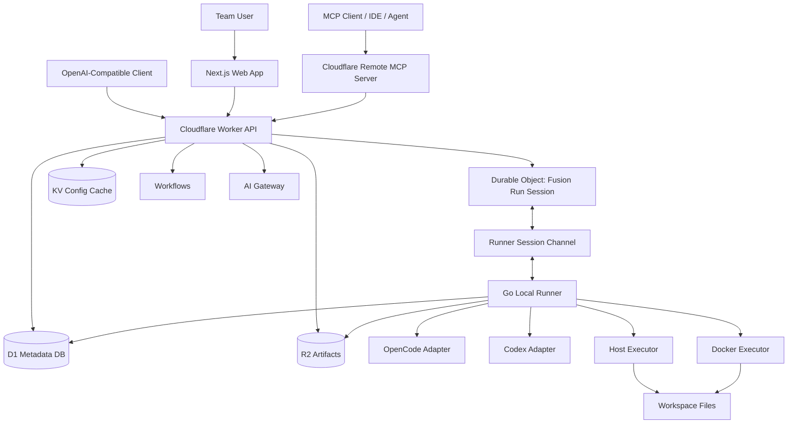

# openFusion — Product Plan

**Document status:** v1.0 planning draft  
**Prepared for:** Internal team product build  
**Current date:** 2026-06-16  
**Primary stack:** Cloudflare + Next.js + Go local runner  
**Initial adapters:** OpenCode and Codex  

---

## 1. Executive Summary

openFusion is a team-internal AI coding and reasoning platform inspired by OpenRouter Fusion. The product lets a team send one request to multiple available AI models or coding agents, collect their independent analysis, compare their outputs through a judge step, and produce a final fused answer or code change.

The key product difference is that openFusion is **local-runner aware**. It can detect tools installed on a developer machine or internal runner, such as OpenCode and Codex, and use either:

1. the developer's existing authenticated CLI/session/subscription, or
2. team-managed API keys routed through the cloud control plane.

The cloud system coordinates users, projects, presets, run history, audit logs, real-time streaming, MCP, and cloud sync. The local runner performs host-specific work: detecting installed tools, running OpenCode/Codex, editing files, executing commands, creating patches, and optionally running commands inside Docker sandboxes.

---

## 2. Confirmed Requirements

| Area | Decision |
|---|---|
| Product type | Team internal tool |
| Operating systems | macOS, Windows, Linux |
| First interface | Web app |
| Later interface | Desktop app |
| Authentication style | Both installed CLI sessions/subscriptions and API keys |
| Agent permissions | Can run commands and edit/create files |
| First integrations | OpenCode and Codex |
| API compatibility | OpenAI-compatible `/v1/chat/completions` and `/v1/models` |
| MCP | Yes, remote MCP and later local stdio MCP |
| Sync | Cloud sync required |
| Fusion default | Same-provider/subscription-first, then quality fallback |
| Cloud stack | Cloudflare Workers, D1, Durable Objects, KV, R2, Workflows, AI Gateway, Access/Tunnel |
| Local runner stack | Go native binary with optional Docker executor |

---

## 3. Product Vision

Build the internal team platform for **multi-model AI coding and decision making**.

A developer should be able to ask:

> “Implement this feature safely, compare approaches from Codex and OpenCode, run tests in Docker, and give me a patch I can review.”

openFusion should then:

1. choose available models based on team policy and local availability,
2. run multiple AI agents/models independently,
3. compare their outputs,
4. generate a final plan or patch,
5. show a full trace of what happened,
6. sync artifacts and audit logs to the cloud,
7. expose the same capability to other tools through OpenAI-compatible API and MCP.

---

## 4. Inspiration: OpenRouter Fusion Pattern

OpenRouter's Fusion pattern uses a panel of models that answer a prompt in parallel, a judge model that compares their responses, and a final model that uses the structured judge analysis to produce the final answer.[^openrouter-fusion-tool] OpenRouter also exposes Fusion through a model/router alias and plugin/server-tool styles.[^openrouter-fusion-router][^openrouter-fusion-plugin]

openFusion should copy the **architecture pattern**, not OpenRouter's backend:

```text
User prompt
  -> selected panel models / agents
  -> parallel independent outputs
  -> judge synthesis
  -> final writer / code agent
  -> answer, patch, artifacts, audit trace
```

Key fusion analysis fields:

- consensus
- contradictions
- missing coverage
- unique insights
- blind spots
- risk level
- recommended final strategy

---

## 5. Goals and Non-Goals

### 5.1 Goals

1. Create a reliable internal product that coordinates multiple coding models/agents.
2. Support OpenCode and Codex first.
3. Detect installed tools and model availability on macOS, Windows, and Linux.
4. Use either local authenticated CLI sessions or team API keys.
5. Provide a web app first, then desktop app.
6. Provide OpenAI-compatible APIs for integration with existing clients.
7. Provide MCP tools so external agents/IDEs can call openFusion.
8. Store team sync data in Cloudflare.
9. Keep execution secure through explicit workspace and command permissions.
10. Store full traces, outputs, artifacts, patches, and audit events.

### 5.2 Non-Goals for V1

1. Do not build a public SaaS yet.
2. Do not bypass provider subscription limits or terms.
3. Do not scrape private tokens, browser cookies, local credential stores, or keychains.
4. Do not run untrusted arbitrary code directly on Cloudflare Workers.
5. Do not make the cloud Worker responsible for detecting tools on developer machines.
6. Do not support every provider in V1; start with OpenCode and Codex.

---

## 6. Product Modules

```text
openFusion
├── Web App
├── Cloud API
├── Fusion Orchestrator
├── Runner Registry
├── Go Local Runner
├── OpenCode Adapter
├── Codex Adapter
├── Host Executor
├── Docker Executor
├── Model Registry
├── Artifact Store
├── Audit Log
├── OpenAI-Compatible API
└── MCP Server
```

---

## 7. Architecture Overview



### Core rule

Cloudflare is the **control plane**. The Go local runner is the **execution plane**.

This split is mandatory because Cloudflare Workers cannot inspect or execute binaries installed on a developer laptop. The local runner detects and runs OpenCode/Codex on the host, then streams events and artifacts back to Cloudflare.

---

## 8. Cloudflare Platform Role

| Cloudflare Product | Product Role | Notes |
|---|---|---|
| Workers | API runtime, OpenAI-compatible endpoint, web backend | Cloudflare supports deploying Next.js to Workers with the OpenNext adapter.[^cf-next] |
| Durable Objects | Live run/session state, WebSocket coordination, runner connection state | Durable Objects provide stateful coordination and strongly consistent attached storage.[^cf-do] |
| D1 | Relational metadata: orgs, users, runs, models, runners | D1 is serverless SQL; individual DBs have storage limits, so large traces go to R2.[^cf-d1-limits] |
| KV | Read-heavy config cache: presets, feature flags, provider catalog | KV is eventually consistent, so it must not hold critical run state.[^cf-kv] |
| R2 | Large artifacts: transcripts, patches, logs, repo snapshots, model outputs | R2 is object storage for unstructured data and has no egress bandwidth fees.[^cf-r2] |
| Workflows | Durable multi-step background processes | Workflows can retry steps and persist state across long-running flows.[^cf-workflows] |
| AI Gateway | API-key model routing, observability, fallback, rate limits | AI Gateway provides analytics, caching, rate limiting, retries, and model fallback.[^cf-ai-gateway] |
| Access | Internal identity-aware access control | Use for team access to the web app and APIs. |
| Tunnel | Optional private runner connectivity | Tunnel uses outbound-only connections, reducing inbound exposure.[^cf-tunnel] |
| Sandbox SDK / Containers | Future cloud execution for team-managed API-key jobs | Sandbox SDK supports isolated command/file execution from Workers.[^cf-sandbox] |
| Remote MCP | Remote tool interface for agents and IDEs | Cloudflare supports remote MCP servers using Streamable HTTP.[^cf-mcp] |

---

## 9. Local Runner Role

The local runner is a native Go binary installed on developer machines or trusted internal machines.

### Responsibilities

1. Detect installed tools:
   - `opencode`
   - `codex`
   - `git`
   - `docker`
   - package managers where needed
2. Check versions.
3. Check whether OpenCode/Codex are authenticated without reading secrets.
4. List available models where the tool supports model listing.
5. Connect to Cloudflare using a team-issued runner token.
6. Receive jobs.
7. Execute jobs through host or Docker executors.
8. Enforce workspace and command policies.
9. Stream logs and structured events.
10. Produce patches, artifacts, and usage summaries.
11. Upload artifacts to R2 through signed upload URLs.
12. Record audit events.

### Why Go

Go is a good runner language because it produces simple native binaries, has strong standard-library support for process execution, and is easy to cross-compile for Windows/macOS/Linux for pure Go programs.[^go-exec][^go-cross]

### Why Docker is optional

Docker should be used as an execution sandbox for project commands, tests, builds, and risky shell operations. The runner itself should remain native because host detection and subscription/session reuse require host access.

```text
Use host executor for:
- opencode detection and execution
- codex detection and execution
- local subscription/session reuse
- Git/SSH operations that require host credentials, when allowed

Use Docker executor for:
- npm test
- pnpm build
- pytest
- go test ./...
- sandboxed generated scripts
- reproducible build/test environments
```

---

## 10. Fusion Modes

### 10.1 Direct Mode

Use one selected model or agent.

```yaml
mode: direct
model: codex/gpt-5-codex
```

### 10.2 Fusion Required

Always call panel models, judge, then final writer.

```yaml
mode: required
preset: quality
```

### 10.3 Fusion Auto

Planner decides whether a request needs fusion.

```yaml
mode: auto
trigger_when:
  - architectural_decision
  - high_risk_code_change
  - security_review
  - migration_plan
  - ambiguous_problem
```

### 10.4 Same-Provider First

Prefer multiple models from one provider/subscription when available.

```yaml
mode: required
provider_policy: same_provider_first
```

### 10.5 Same-Model Self-Fusion

Run the same model multiple times with different roles and temperatures.

```yaml
mode: required
same_model:
  model: codex/gpt-5-codex
  samples: 3
  roles:
    - architect
    - critic
    - implementer
```

---

## 11. Initial Product Presets

```yaml
presets:
  same-provider-first:
    description: Prefer models from the same authenticated provider or subscription.
    min_panel_models: 2
    max_panel_models: 5
    timeout_ms: 120000
    model_selection:
      provider_policy: same_provider_first
      fallback: best_quality_available

  opencode-quality:
    description: Use OpenCode as the main harness.
    adapters:
      include: [opencode]
    max_panel_models: 4
    timeout_ms: 120000

  codex-quality:
    description: Use Codex models first.
    adapters:
      include: [codex]
    max_panel_models: 4
    timeout_ms: 120000

  mixed-coding:
    description: Use both OpenCode and Codex.
    adapters:
      include: [opencode, codex]
    max_panel_models: 6
    timeout_ms: 180000

  fast:
    description: Faster, lower-latency response.
    max_panel_models: 2
    timeout_ms: 45000

  budget:
    description: Prefer fewer calls and cheaper API-key models.
    max_panel_models: 2
    cost_policy: low
```

---

## 12. User Experience

### 12.1 Web App Screens

1. **Chat / Task Console**
   - Prompt input
   - Workspace selector
   - Fusion mode selector
   - Model/preset selector
   - Permission profile selector
   - Streaming response

2. **Fusion Trace**
   - Panel model status
   - Raw panel outputs
   - Judge analysis
   - Final answer
   - Timings and errors
   - Cost/usage estimate

3. **Runner Dashboard**
   - Online/offline runners
   - OS/architecture
   - installed tools
   - available models
   - Docker availability
   - last heartbeat

4. **Workspace Permissions**
   - allowed paths
   - command policy
   - network policy
   - edit policy

5. **Artifacts**
   - patches
   - changed files
   - logs
   - transcripts
   - generated files
   - test outputs

6. **Models**
   - installed/local models
   - CLI-auth models
   - API-key models
   - model health
   - verified/unverified availability

7. **Presets**
   - edit team presets
   - default team policy
   - same-provider preferences

8. **Audit Log**
   - who ran what
   - which runner executed it
   - commands used
   - files touched
   - approvals granted

9. **API / MCP Setup**
   - team API keys
   - OpenAI-compatible endpoint
   - MCP endpoint
   - local stdio MCP config

---

## 13. Permission Model

### 13.1 Permission Profiles

```yaml
permission_profiles:
  readonly:
    description: Safe analysis only.
    filesystem:
      read: allow
      write: deny
    shell:
      run: deny
    network:
      access: deny

  workspace_write:
    description: Allow edits inside approved workspaces. Ask before shell/network.
    filesystem:
      read: allow
      write: workspace_only
    shell:
      run: ask
    network:
      access: ask

  trusted_internal:
    description: Trusted internal automation with allowlisted commands.
    filesystem:
      read: allow
      write: workspace_only
    shell:
      run: allowlist
      allow:
        - git status
        - git diff *
        - npm test
        - pnpm test
        - pnpm build
        - go test ./...
        - pytest
    network:
      access: allowlist
```

### 13.2 Default Safety Rules

1. Never allow `danger-full-access` by default.
2. Never allow shell execution outside an approved workspace without explicit admin policy.
3. Never mount private credential directories into Docker by default.
4. Never upload full repository snapshots unless the user/team policy allows it.
5. Prefer patch review before applying changes to the real workspace.
6. Store all command execution and file edit events in the audit log.

---

## 14. Docker Sandbox Strategy

Docker is valuable, but it is not a complete security boundary unless configured carefully. Docker's own docs explain the daemon attack surface and rootless mode, and bind mounts connect host paths into containers.[^docker-security][^docker-rootless][^docker-bind]

### Recommended Docker defaults

```yaml
docker_defaults:
  privileged: false
  network: none
  cap_drop: ["ALL"]
  no_new_privileges: true
  read_only_rootfs: true
  memory_limit: "4g"
  cpu_limit: 2
  workspace_mount_mode: rw_for_approved_jobs_only
  secret_mounts: deny
  docker_socket_mount: deny
```

### Never mount by default

```text
~/.ssh
~/.aws
~/.config
~/.codex
~/.opencode
~/.gitconfig
/var/run/docker.sock
.env
.env.*
```

---

## 15. Data Storage Strategy

### 15.1 D1

Use D1 for queryable relational metadata:

- organizations
- users
- workspaces
- runners
- installed tools
- model registry
- run status
- audit indexes
- artifact object keys

Do not store large model outputs or transcripts directly in D1. D1 has a per-database storage limit, so use R2 for large payloads and keep pointers in D1.[^cf-d1-limits]

### 15.2 R2

Use R2 for:

- full raw panel outputs
- judge JSON
- final answer transcript
- log streams
- command output
- patches
- generated files
- zipped artifacts
- optional sanitized repo snapshots

### 15.3 Durable Objects

Use Durable Objects for:

- live run state
- WebSocket fanout
- runner session state
- per-run event buffer
- active approval prompts

### 15.4 KV

Use KV for:

- cached preset catalog
- provider/model catalog
- feature flags
- non-critical config

Do not use KV for run state or approval state because KV is eventually consistent.[^cf-kv]

---

## 16. Cloud Sync Model

### Sync to cloud

- run metadata
- messages
- sanitized prompts if policy allows
- model metadata
- runner capabilities
- team presets
- audit logs
- patches and artifacts
- final outputs
- usage statistics

### Do not sync by default

- raw local provider tokens
- OpenCode credentials
- Codex credentials
- full `.env` files
- SSH keys
- private package registry tokens
- full repository snapshots unless explicitly allowed

---

## 17. API Product Requirements

### 17.1 Native API

```http
GET  /api/health
GET  /api/runners
POST /api/runners/register
GET  /api/models
POST /api/models/discover
POST /api/fusion/runs
GET  /api/fusion/runs/:id
GET  /api/fusion/runs/:id/events
POST /api/fusion/runs/:id/approve
POST /api/fusion/runs/:id/cancel
GET  /api/artifacts/:id
```

### 17.2 OpenAI-Compatible API

```http
GET  /v1/models
POST /v1/chat/completions
```

Model aliases:

```text
local/fusion
local/fusion-fast
local/fusion-quality
local/fusion-same-provider
local/opencode
local/codex
```

### 17.3 MCP Tools

```text
fusion.run
fusion.get_run
fusion.list_models
fusion.list_runners
fusion.get_artifacts
fusion.apply_patch
fusion.cancel_run
```

Cloudflare supports remote MCP servers, and MCP supports both remote Streamable HTTP and local stdio modes.[^cf-mcp]

---

## 18. Roadmap

### Phase 0 — Discovery and hardening decisions

**Goal:** remove ambiguity before implementation.

Deliverables:

- final architecture decision record
- permission matrix
- artifact retention policy
- provider/subscription policy
- initial threat model
- monorepo skeleton

Acceptance criteria:

- team agrees on local-runner execution model
- no cloud-only local-tool detection assumption remains
- OpenCode/Codex command compatibility confirmed on at least one machine

---

### Phase 1 — Cloud shell

**Goal:** deploy the cloud control plane and empty UI.

Deliverables:

- Next.js web app on Cloudflare Workers
- Cloudflare Access protection
- D1 schema and migrations
- R2 bucket
- KV namespace
- basic Durable Object for run state
- basic `/api/health`
- basic `/v1/models`
- runner registration table

Acceptance criteria:

- team user can log in
- dashboard loads
- D1 migrations run in dev and staging
- cloud API can create a run record

---

### Phase 2 — Go local runner MVP

**Goal:** installable runner that discovers tools.

Deliverables:

- `fusion-runner doctor`
- `fusion-runner login`
- `fusion-runner discover`
- `fusion-runner serve`
- OS detection
- `opencode` detection
- `codex` detection
- Docker detection
- heartbeat to Cloudflare

Acceptance criteria:

- runner connects from macOS, Windows, Linux
- web dashboard shows runner online/offline
- runner reports installed tools and versions
- runner does not read secret files directly

---

### Phase 3 — OpenCode adapter

**Goal:** run non-interactive OpenCode jobs.

Deliverables:

- detect OpenCode
- list models using `opencode models`
- run analysis using `opencode run`
- support JSON event output when available
- optional `opencode serve` mode
- temporary per-job permission config

Acceptance criteria:

- user can run one OpenCode task from web app
- output streams to trace UI
- artifacts are stored in R2
- command/file edits are audited

OpenCode supports model listing and non-interactive `opencode run`, and its headless server exposes an OpenAPI endpoint for programmatic integration.[^opencode-cli][^opencode-server]

---

### Phase 4 — Codex adapter

**Goal:** run Codex jobs with sandbox settings.

Deliverables:

- detect Codex
- inspect model catalog where available
- run `codex exec` jobs
- support JSON output mode
- map permission profiles to Codex sandbox policies
- record command/edit events

Acceptance criteria:

- user can run one Codex task from web app
- Codex output streams to trace UI
- `read-only` and `workspace-write` policies work
- dangerous modes require explicit admin approval

Codex CLI supports both ChatGPT sign-in and API keys, and its sandboxing docs describe the sandbox as the boundary for autonomous local command execution.[^codex-auth][^codex-sandbox]

---

### Phase 5 — Fusion orchestration

**Goal:** run panel, judge, and final writer.

Deliverables:

- panel model execution
- parallel task dispatch
- timeout and cancellation
- partial failure handling
- judge JSON schema
- final writer prompt
- trace UI
- usage summary

Acceptance criteria:

- same-provider-first preset works
- OpenCode + Codex mixed preset works
- judge returns strict JSON
- final answer uses judge output
- raw panel outputs are available in trace UI

---

### Phase 6 — File edits, patches, and Docker executor

**Goal:** support real coding tasks safely.

Deliverables:

- workspace allowlist
- Git worktree/snapshot strategy
- patch generation
- Docker executor
- allowed command policy
- artifact upload
- manual approval flow

Acceptance criteria:

- AI can modify files in a temporary workspace
- user can review patch before applying
- tests can run in Docker
- commands outside allowlist require approval or are blocked

---

### Phase 7 — OpenAI-compatible API and MCP

**Goal:** integrate with other tools.

Deliverables:

- `/v1/chat/completions`
- streaming support
- model aliases
- remote MCP server
- MCP auth
- local stdio MCP prototype

Acceptance criteria:

- an OpenAI-compatible client can call `local/fusion`
- an MCP client can call `fusion.run`
- run traces appear in web UI regardless of source

---

### Phase 8 — Team product polish

**Goal:** make it usable by the internal team daily.

Deliverables:

- audit dashboard
- admin settings
- retention policies
- runner auto-update
- desktop app prototype
- CI/CD
- eval suite
- documentation

Acceptance criteria:

- internal team can onboard without engineering help
- logs, costs, and failures are explainable
- runner can update safely
- product is stable enough for daily coding tasks

---

## 19. Success Metrics

### Adoption

- active weekly users
- active runners
- runs per week
- average runs per workspace

### Reliability

- run success rate
- panel model failure rate
- runner disconnect rate
- artifact upload success rate
- median and p95 run duration

### Quality

- accepted patches
- reverted patches
- user rating per final answer
- number of tasks completed without manual correction

### Safety

- blocked dangerous commands
- approval prompts generated
- unauthorized workspace access attempts
- secret detection events

### Cost and Efficiency

- model/API spend by org/user/workspace
- average panel size
- same-provider reuse rate
- cache/fallback usage

---

## 20. Key Risks and Mitigations

| Risk | Impact | Mitigation |
|---|---:|---|
| Provider subscription misuse | High | Use installed CLIs only through official auth; do not scrape credentials; do not resell personal subscriptions. |
| CLI output changes | Medium | Adapter contract tests; version detection; fallback parsers. |
| Dangerous shell commands | High | Deny by default; command allowlist; Docker sandbox; approvals. |
| Secret leakage to cloud | High | redaction, path denylist, artifact policy, no secret mounts. |
| D1 storage growth | Medium | Store large payloads in R2; D1 only stores metadata and pointers. |
| Runner compromised | High | scoped runner tokens, rotation, audit logs, workspace allowlists. |
| Docker false sense of security | High | no privileged containers, no Docker socket mounts, rootless recommendation. |
| Latency from multi-model fusion | Medium | fast preset, cancellation, partial-failure finalization. |
| Cross-platform complexity | Medium | Go native runner, OS abstraction, WSL-specific guidance. |

---

## 21. Architecture Decision Records

### ADR-001: Cloudflare as control plane

**Decision:** Use Cloudflare Workers, D1, Durable Objects, KV, R2, Workflows, AI Gateway, Access, and MCP for the cloud layer.

**Reason:** The product needs a lightweight team control plane with global access, real-time coordination, object storage, SQL metadata, and AI routing.

**Consequence:** Execution that needs host-installed tools must stay in the local runner.

---

### ADR-002: Go local runner

**Decision:** Implement the local runner in Go.

**Reason:** Go gives simple cross-platform binaries, process execution, long-running service behavior, and low deployment friction.

**Consequence:** UI/cloud code remains TypeScript, while runner code is Go.

---

### ADR-003: Docker as optional executor, not the runner itself

**Decision:** The runner is native. Docker is a pluggable execution backend.

**Reason:** Host-installed OpenCode/Codex detection and local subscription/session reuse require host access. Docker is still useful for sandboxed project commands.

**Consequence:** The runner must implement both `host` and `docker` executors.

---

### ADR-004: R2 for artifacts, D1 for metadata

**Decision:** Store large payloads in R2 and references in D1.

**Reason:** Model traces, command logs, patches, and artifacts can grow quickly; D1 has per-database storage constraints.

**Consequence:** Every large object must have an object key, checksum, content type, and retention policy.

---

### ADR-005: Same-provider-first default

**Decision:** Default selection policy prefers multiple available models from the same provider/subscription, then falls back to best available mixed-provider quality.

**Reason:** This matches the stated product preference and keeps default routing aligned with team subscription availability.

**Consequence:** Model registry must group by provider, adapter, auth mode, and verified availability.

---

## 22. Source References

[^openrouter-fusion-tool]: OpenRouter Fusion Server Tool docs: https://openrouter.ai/docs/guides/features/server-tools/fusion
[^openrouter-fusion-router]: OpenRouter Fusion Router docs: https://openrouter.ai/docs/guides/routing/routers/fusion-router
[^openrouter-fusion-plugin]: OpenRouter Fusion Plugin docs: https://openrouter.ai/docs/guides/features/plugins/fusion
[^cf-next]: Cloudflare Next.js on Workers docs: https://developers.cloudflare.com/workers/framework-guides/web-apps/nextjs/
[^cf-do]: Cloudflare Durable Objects docs: https://developers.cloudflare.com/durable-objects/
[^cf-d1-limits]: Cloudflare D1 limits: https://developers.cloudflare.com/d1/platform/limits/
[^cf-kv]: Cloudflare KV consistency docs: https://developers.cloudflare.com/kv/concepts/how-kv-works/
[^cf-r2]: Cloudflare R2 docs: https://developers.cloudflare.com/r2/
[^cf-workflows]: Cloudflare Workflows docs: https://developers.cloudflare.com/workflows/
[^cf-ai-gateway]: Cloudflare AI Gateway docs: https://developers.cloudflare.com/ai-gateway/
[^cf-tunnel]: Cloudflare Tunnel docs: https://developers.cloudflare.com/cloudflare-one/networks/connectors/cloudflare-tunnel/
[^cf-sandbox]: Cloudflare Sandbox SDK docs: https://developers.cloudflare.com/sandbox/
[^cf-mcp]: Cloudflare MCP docs: https://developers.cloudflare.com/agents/model-context-protocol/
[^opencode-cli]: OpenCode CLI docs: https://opencode.ai/docs/cli/
[^opencode-server]: OpenCode server docs: https://opencode.ai/docs/server/
[^codex-auth]: OpenAI Codex authentication docs: https://developers.openai.com/codex/auth
[^codex-sandbox]: OpenAI Codex sandboxing docs: https://developers.openai.com/codex/concepts/sandboxing
[^go-exec]: Go `os/exec` package docs: https://pkg.go.dev/os/exec
[^go-cross]: Go cross-compilation wiki: https://go.dev/wiki/WindowsCrossCompiling
[^docker-security]: Docker Engine security docs: https://docs.docker.com/engine/security/
[^docker-rootless]: Docker rootless mode docs: https://docs.docker.com/engine/security/rootless/
[^docker-bind]: Docker bind mounts docs: https://docs.docker.com/engine/storage/bind-mounts/
